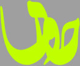
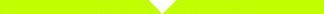

<html>
<head>
<title>حوری</title>
<meta http-equiv="Content-Type" content="text/html; charset=utf-8">
<link rel="stylesheet" type="text/css" href="styles.css">
</head>
<body bgcolor="#9f9f9f" dir="rtl"> 
 
<table align="center"  cellpadding="0" cellspacing="0">
	<tr bgcolor="#9F9F9F">
		<td valign="top" width="97px">
			
سلام
			
		</td>	
		<td valign="top">
			
		</td>
		<td valign="top" width="10px">
			
خوش اومدین.

		</td>				
	</tr>	
	<tr>
		<td colspan="3" height="33" width="324">
			
		</td>	
	</tr>
	<tr>
		<td bgcolor="#FFFFFF" colspan="3" height="70">
		</td>	
	</tr>
			
	<ul >
	    
	    <li><a href="{{ BASE_PATH }}{{ post.url }}" style="font-size:20px;">{{ post.title }}</a></li>
		{{ post.content | strip_html | truncatewords:75}} 
		    <a href="{{ post.url }}">مطلب کامل</a> 
		

	    
	</ul>

	<tr>
		<td bgcolor="#FFFFFF" colspan="3" height="70">
		</td>	
	</tr>	
	<tr>
		<td align="center" colspan="3">
			
		</td>			
	</tr>
	<tr>
	</tr>
	<tr>
	<td align="center" colspan="3">
			
		</td>			
	</tr>
		
</table>
</body>
</html>
